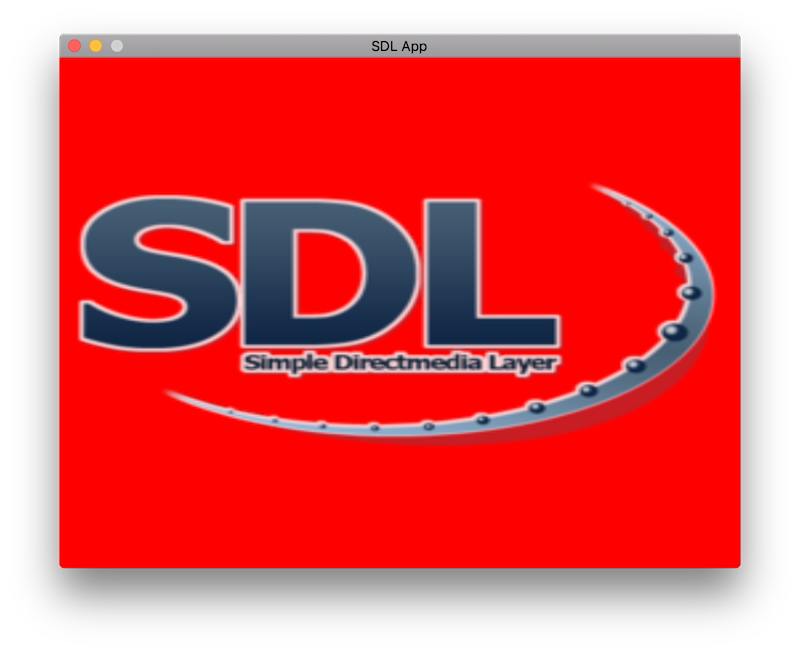

Modern SDL2 OpenGL Boilerplate for C/C++
========================================

Want to just dive in and get your SDL2/GL application going? Me too. Here's
a no-fuss boilerplate for you.

Short and sweet:
* Create a window
* Create an OpenGL context
* Initialize basic shaders, geometry, and a texture
* Render a couple textured triangles
* Handle main window close event



Based on inline code snippets from the tutorials at [https://open.gl](https://open.gl).

License
-------
[CC0 (DWTFYW)](https://creativecommons.org/publicdomain/zero/1.0/legalcode)

Build Instructions
------------------
You can use the provided CMake setup if you want to keep it simple. On macOS,
it looks like:

```
$ brew install cmake sdl2 glew
$ mkdir build; cd build
$ cmake .. && make
$ ./sdl_app
```
